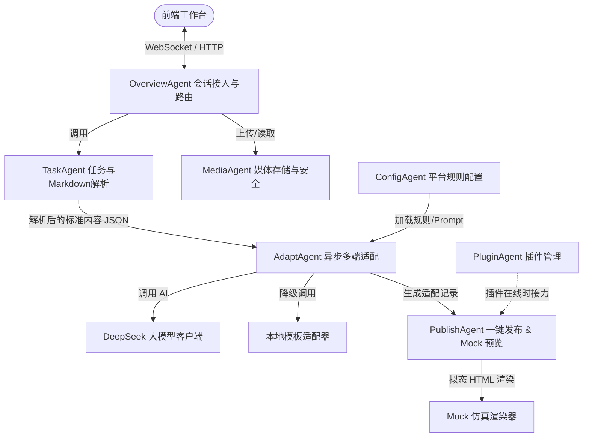

# Pulse Distro 项目架构设计与决策

本项目是一个单体 Java 21 + Spring Boot 应用，旨在为多平台内容分发提供轻量、健壮的解决方案。在系统设计中，我们重点权衡了**模块解耦**、**高可用性（网络/大模型异常兜底）**和**用户操作体验**。

---

## 1. 系统模块拓扑图



---

## 2. 模块职责与核心契约

项目由 7 个核心业务模块协作完成，各模块职责清晰，边界明确：

| 模块名称 | 核心职责 | 关键设计决策与架构原因 |
| :--- | :--- | :--- |
| **OverviewAgent** | 会话初始化、WebSocket 维护、事件单播推送。 | **用户会话隔离**：通过 URI 中的 `userToken` 隔离不同作者的数据流。在内存中为每个 Token 维护历史 100 条事件队列，断线重连时能通过 HTTP 接口一次性补齐，极大增强了弱网环境下的前端体验。 |
| **TaskAgent** | 任务管理、Markdown 解析与标准化。 | **内容积木化（Decoupling）**：使用 Flexmark 将 Markdown 转化为统一的 JSON 块。此设计隔离了输入端与输出端，增加新发布平台时无需修改解析逻辑，只需读取标准化积木块。 |
| **MediaAgent** | 媒体上传、哈希去重、防穿越校验、物理删除。 | **防御性设计与流式读取**：使用 SHA-256 对同一任务下的相同图片去重；采用流式 `FileSystemResource` 响应下载，避免大图片一次性加载进 JVM 堆内存导致 OOM；删除图片时进行 409 强引用校验，防止排版碎图。 |
| **ConfigAgent** | 平台规则模板的加载、校验约束管理。 | **动态 CLOB 存储**：平台规则以原始 JSON 存入 Clob，匹配时才反序列化。此设计能够灵活应对各平台规则字段频繁扩展的痛点，避免频繁修改数据库 Schema。 |
| **AdaptAgent** | 后台多平台异步适配、双层降级算法。 | **非阻塞与可靠性（高可用）**：适配操作涉及大模型网络调用，耗时极长，故使用专属线程池 `adaptTaskExecutor` 异步执行。当 AI 不可用或网络超时，无缝切入 Template 适配，并抛出 `PLATFORM_ADAPT_DEGRADED` 警告事件，保证服务不中断。 |
| **PublishAgent** | Mock 发布控制、自适应响应式拟态 HTML 生成。 | **样板间理念**：不绑定真实账号和 API 密钥即可完成仿真预览。网页模版利用 Tailwind CSS v4 CDN 动态拼装，高保真模拟小红书（手机卡片）、知乎等样式，确保“所见即所得”。 |
| **PluginAgent** | 插件连接管理、心跳保活、真实发布接力。 | **解耦浏览器自动化**：避免在 Java 服务器端直接运行 Puppeteer 带来的巨大内存开销和验证码识别困难，通过前台插件心跳检测和复活期（300s）管理，将真实发布工作移至用户端浏览器。 |

---

## 3. 核心数据模型关系 (JPA)

```
                       ┌─────────────────────────┐
                       │       ContentTask       │ ◄──────────────────┐
                       │  (任务元数据与标准内容JSON) │                  │
                       └────────────┬────────────┘                  │
                                    │ (1 : N)                       │ (1 : N)
            ┌───────────────────────┴───────────────────────┐        │
            ▼                                               ▼        │
┌─────────────────────────┐                     ┌────────────────────┴────┐
│      MediaResource      │                     │  PlatformPublishRecord  │
│  (媒体上传元数据与SHA-256) │                     │   (平台适配稿与Mock状态)   │
└─────────────────────────┘                     └─────────────────────────┘
```

*   **`ContentTask`**：代表一篇内容创作源头，包含 `status`（`PENDING`、`ADAPTING`、`READY`、`FAILED`）。
*   **`MediaResource`**：存放本地物理图片的元数据。`storageKey` 遵循 `{taskId}/{sha256}.{ext}` 路径。
*   **`PlatformPublishRecord`**：适配后的产物。`status`（`ADAPTING`、`READY`、`SUCCESS`、`FAILED`、`SKIPPED`），在发布前 `publish_mode` 允许为 null。
